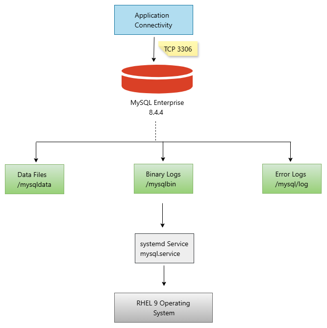

# MySQL 8.4 Enterprise Deployment and Security Hardening

## Project Overview

## Key Achievements

✅ Deployed MySQL Enterprise Server 8.4.4 using binary installation methodology
✅ Implemented enterprise filesystem separation for software binaries, database files, binary logs, and diagnostic logs
✅ Configured custom MySQL data directory and logging architecture
✅ Implemented MySQL security hardening using industry best practices
✅ Enabled binary logging to support replication and Point-in-Time Recovery (PITR)
✅ Configured systemd service management with automatic startup and recovery capabilities
✅ Implemented runtime directory persistence using systemd tmpfiles
✅ Validated installation, service availability, database accessibility, and logging functionality
✅ Prepared the environment for enterprise application onboarding


This project demonstrates the end-to-end deployment, configuration, validation, and security hardening of MySQL Enterprise Server 8.4 on Red Hat Enterprise Linux 9 using enterprise database administration best practices.

The implementation includes:

- Operating system preparation
- Storage provisioning
- MySQL Enterprise binary installation
- Configuration management
- Service configuration
- Security hardening
- Validation testing
- Operational readiness verification

---

## Architecture

### Deployment Architecture

architecture/README.md

<a href="architecture/mysql-enterprise-architecture.png">
 
</a>
<p align="center">
<sub><i>Figure 1: MySQL Enterprise Server 8.4 deployment architecture on Red Hat Enterprise Linux 9.</i></sub>
</p>
---

## Documentation

### Installation Guide

Detailed deployment and installation procedures.

📄 docs/installation.md

---

### Security Hardening Guide

Enterprise hardening activities and security controls.

📄 docs/hardening.md

---

### Validation Guide

Post-installation validation and operational readiness checks.

📄 docs/validation.md

---

## Configuration Files

### MySQL Configuration

📄 config/my.cnf

### Systemd Service

📄 config/mysql.service

### Runtime Directory Configuration

📄 config/mysql.conf

---

## Deployment Validation Screenshots

📷 screenshots/README.md

Included validations:

- MySQL Version Verification
- Service Status Validation
- Data Directory Verification
- Binary Log Verification
- Database Initialization Verification

---

## Skills Demonstrated

### MySQL Administration

- MySQL Enterprise Installation
- Database Initialization
- Binary Logging
- Configuration Management
- Systemd Service Management

### Linux Administration

- RHEL 9 Administration
- Storage Management
- User and Group Administration
- Runtime Directory Management

### Security Hardening

- Password Validation Policies
- Root Account Protection
- Anonymous User Removal
- Secure File Permissions
- Runtime Security Controls

### Operations Readiness

- Validation Procedures
- Service Monitoring
- Startup Automation
- Logging Configuration

---

## Technologies Used

- MySQL Enterprise Server 8.4
- Red Hat Enterprise Linux 9
- systemd
- Shell Administration
- Enterprise Storage Layout

---

## Project Outcome

The deployment successfully achieved:

✅ MySQL Enterprise Installation

✅ Security Hardening

✅ Binary Logging Configuration

✅ Runtime Directory Persistence

✅ Service Automation

✅ Operational Readiness Validation

✅ Application Onboarding Readiness

---

## Repository Structure

```text
mysql-8.4-enterprise-deployment/
│
├── README.md
│
├── architecture/
│   ├── README.md
│   └── mysql-enterprise-architecture.png
│
├── config/
│   ├── my.cnf
│   ├── mysql.service
│   └── mysql.conf
│
├── docs/
│   ├── installation.md
│   ├── hardening.md
│   └── validation.md
│
└── screenshots/
    ├── README.md
    ├── mysql-version.png
    ├── systemctl-status.png
    ├── datadir.png
    ├── binary-logs.png
    └── show-databases.png
```

---

## Author

**Paul Chukwujekwu**

Manager, Database Administrator

Enterprise Database Administration Portfolio
