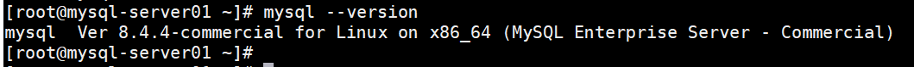
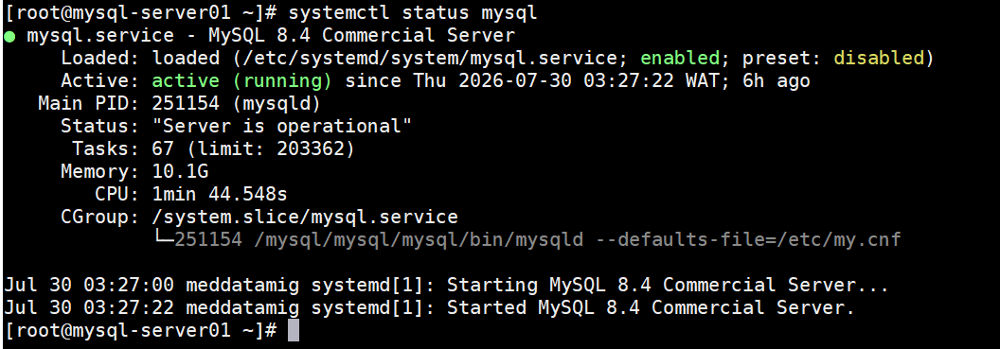
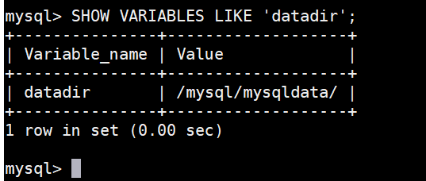
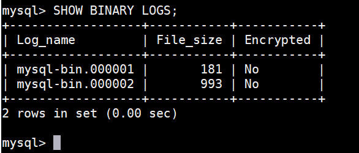
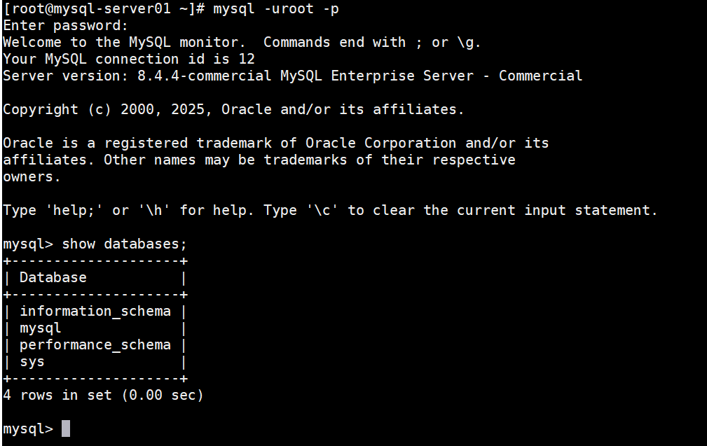

# Deployment Validation Screenshots

This directory contains sanitized screenshots collected during the deployment, hardening, and validation of MySQL Enterprise Server 8.4.

> **Note:** All screenshots have been sanitized to remove environment-specific information such as hostnames, IP addresses, usernames, passwords, and organization identifiers.

---

## MySQL Version Validation

**Purpose:** Verifies the successful installation of MySQL Enterprise Server 8.4.

### Screenshot

---

## Service Status Validation

**Purpose:** Confirms that the MySQL service is active, running, and managed by systemd.

### Screenshot

---

## Data Directory Validation

**Purpose:** Confirms that MySQL is using the configured data directory.

### Screenshot

---

## Binary Log Validation

**Purpose:** Verifies binary logging is enabled for recovery and replication readiness.

### Screenshot

---

## Database Initialization Validation

**Purpose:** Confirms successful initialization of MySQL system databases.

### Screenshot

---

## Validation Summary

The deployment was successfully validated with the following checks:

- ✅ MySQL Enterprise Server 8.4 Installed
- ✅ Database Service Running
- ✅ Database Connectivity Verified
- ✅ Data Directory Configured
- ✅ Binary Logging Enabled
- ✅ System Databases Initialized
- ✅ Security Hardening Completed
- ✅ Environment Ready for Application Onboarding
